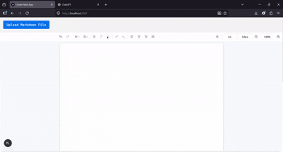

# Qanoon AI



Qanoon AI is a web-based document editor designed to feel like Microsoft Word Online, but smarter for professionals who work with markdown. It takes raw markdown content and transforms it into a polished, professional document that reads more naturally, looks cleaner, and feels more human.

Instead of manually cleaning up AI-generated text, awkward markdown, or messy pasted content, this tool helps you turn it into a refined final draft with clearer structure, better flow, and a stronger impact-focused tone.

## What it does

- Converts markdown into a Word-like editing experience
- Formats content into a polished, readable document
- Helps remove clutter such as excessive separators, em dashes, and overly mechanical phrasing
- Supports structured writing with headings, lists, emphasis, links, highlights, and images
- Gives users a clean workspace for editing, refining, and preparing content for real-world use

## Why it exists

Many professionals, students, and legal writers work with content that starts in markdown, plain text, or AI-generated drafts. The problem is that this content often needs significant cleanup before it is ready for documents, emails, reports, or publication.

Qanoon AI bridges that gap by providing a simple, elegant editor that makes the transition from raw content to polished output feel effortless.

## Key features

- Word-like interface for editing and formatting
- Markdown input support
- Upload markdown files directly
- Paste content and transform it into a cleaner document structure
- Human-like and impact-focused writing presentation
- Professional formatting tools for headings, lists, highlights, and links

## How to use it

1. Open the app in your browser
2. Upload a markdown file or paste markdown content into the editor
3. Let the editor format and structure the content
4. Refine the document using the built-in formatting tools
5. Export or continue editing as needed

## Setup

### Requirements

- Node.js 18 or newer
- npm 9 or newer

### Install dependencies

```bash
npm install
```

### Run locally

```bash
npm run dev
```

Then open:

```text
http://localhost:3000
```

### Build for production

```bash
npm run build
```

## Tech stack

- Next.js
- React
- Tiptap
- TypeScript
- SCSS

## Project goal

Qanoon AI is built to make document creation feel faster, cleaner, and more professional for people who work with markdown and AI-generated content every day.

